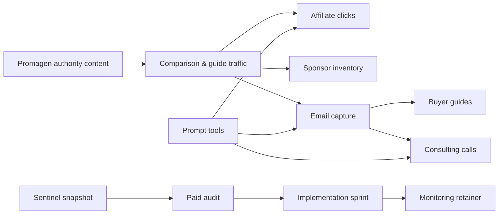
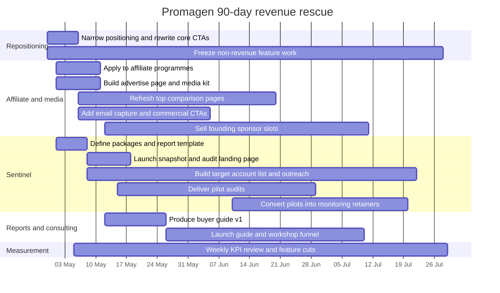

# Revenue-First Rescue Plan for Promagen

## Executive summary

Promagen’s public site is currently trying to be too many things at once: a live “mission control” prompt experience with markets, weather and community ranking on the front page, plus a £15.99/month Pro offer for unlimited prompts and broader tooling. Its strongest public assets, however, are much sharper than that: a 40-platform comparison hub, a four-tier prompt-compatibility framework, a negative-prompt support matrix, use-case recommendation pages, and a BQI methodology page with factual benchmarking logic. In plain commercial terms, the most defensible thing Promagen already owns is structured platform intelligence, not a broad consumer prompt-builder proposition. citeturn23view0turn23view1turn23view2turn23view3turn23view4turn23view5turn6view0

The hard-nosed recommendation is to **change the effective order of operations**. The fastest route to meaningful cash is not a consumer subscription push. It is a **service-led B2B offer built around Sentinel**, sold first as paid audits and retained monitoring, because the AI visibility market already supports software from low-cost self-serve tools to enterprise custom pricing, while broader AI adoption is rising and buyers are actively looking for measurable ROI. Promagen should then use its existing comparison content to build an affiliate and sponsor engine, package buyer guides and consulting as a second monetisation layer, and keep prompt tools only as support features that improve conversion rather than as the centre of the business. citeturn17view0turn16view4turn16view1turn16view2turn17view1turn20search0turn19view2turn18search1turn19view0

My recommended priority order is therefore:

| Priority | Move | Why it comes first |
|---|---|---|
| First | **Sentinel audits + monitoring** | Highest willingness to pay, fastest founder-led sales, strongest path to four-figure deals within 30 days |
| Second | **Platform comparison + affiliate/media** | Best long-term compounding asset because Promagen already has the content spine |
| Third | **Premium reports / buyer guides / consulting** | Quick to package, useful cash bridge, and helps qualify B2B buyers |
| Fourth | **Prompt tools as supporting features** | Valuable for capture and conversion, but weak as a stand-alone turnaround thesis |

The base-case 90-day target should be **£15k cumulative cash collected**, **£2k–£3k committed monthly monitoring revenue**, **two paid sponsor deals**, **three retained Sentinel clients**, and **a live email list of at least 1,000 opted-in contacts**. That is aggressive, but realistic for a founder-led turnaround if the site is narrowed and the sales motion becomes brutally simple.

## Diagnosis

Promagen’s public positioning is broad, but its trust assets are specific. The reference section already explains how 40 AI image generators differ by prompt architecture, character limits, sweet spots and negative-prompt handling; the use-case pages make vendor-neutral recommendations; and the BQI methodology describes a benchmark across 40 platforms and 8 standardised scenes. Those are exactly the kinds of structured, factual pages that can attract commercial-intent traffic from buyers trying to choose tools or understand why their prompting workflow is failing. citeturn23view0turn23view1turn23view2turn23view3turn23view4

By contrast, the public home and Pro surfaces point in several competing directions at once: live prompt generation from exchanges and weather, community Elo-style ranking, saved prompts, multi-format prompt conversion, a coming “bring your own API key” image-generation flow, and a paid Pro plan. That breadth increases build and maintenance load, but it also muddies the commercial message. The market sees a clever product; it does not yet see the shortest path to value or an obvious reason to buy now. citeturn23view5turn6view0

The timing for a B2B AI visibility offer is stronger than it might look at first glance. **entity["company","Adobe","software company"]** says AI-sourced traffic to U.S. retail sites grew 393% year on year in the first quarter of 2026, that AI traffic converted 42% better than non-AI traffic in March 2026, and that many retail pages remain partly unreadable to machines. **entity["company","Cloudflare","web infrastructure company"]** has turned AI crawler visibility and control into a named product area, while Adobe has also launched LLM Optimizer to help brands improve AI search visibility. At the same time, **entity["organization","McKinsey & Company","consulting firm"]** reports that 88% of surveyed organisations are using AI in at least one business function, while **entity["organization","Deloitte","professional services"]** notes rising AI spend but still-elusive ROI. That combination matters: buyers are spending, they want measurable outcomes, and they increasingly need visibility into how machines see their sites. citeturn19view0turn20search8turn20search0turn19view2turn18search1

That is why Promagen should stop asking, “How do we revive the prompt builder?” and instead ask, “Which part of our existing knowledge base can sell fastest?” The answer is: **structured tool intelligence** for media monetisation, and **machine-readability / AI visibility intelligence** for B2B revenue.



## Revenue route comparison

The table below uses scenario modelling rather than first-party analytics. I could not verify Promagen’s actual Google Analytics, Search Console or conversion data from the publicly available material, so these are **planning assumptions**, not forecasts.

| Route | Speed to first cash | Conservative 90-day cash | Realistic 90-day cash | Upside 90-day cash | Month-3 run-rate | Capital intensity | Verdict |
|---|---:|---:|---:|---:|---:|---|---|
| Sentinel audits + monitoring | Fast | £3.3k | £8.4k | £18.0k | £0.35k–£1.75k MRR | Low to medium | **Best first move** |
| Platform comparison + affiliate/media | Medium | £1.2k | £4.5k | £12.0k | £0.5k–£6.3k | Low | **Best compounding move** |
| Premium reports / guides / consulting | Fast | £1.7k | £7.0k | £15.9k | £0.6k–£5.0k | Low | **Strong second cash bridge** |
| Prompt tools as support | Fast, but indirect | not additive | not additive | not additive | 10%–30% conversion uplift | Low | **Keep lean; do not lead with it** |

The reason the B2B route wins on speed is that the market already supports paid AI visibility software and services across a broad price ladder. Public pricing runs from self-serve entry points such as OtterlyAI at $29/month, Semrush’s AI Visibility Toolkit at $99/month, and Ahrefs custom prompt packages from $50/month, up through Scrunch at $250/month and enterprise-led offerings from Profound and Adobe LLM Optimizer. Public audit and GEO service prices also span from roughly $497 to £1,500+ and into multi-thousand-euro audit work. That gives Promagen room to sell a founder-led service immediately without needing a fully finished SaaS product on day one. citeturn17view0turn16view1turn16view2turn16view3turn16view4turn17view1turn20search0turn24search1turn24search2turn24search4turn24search8turn24search10

## Option analysis

### Platform comparison and affiliate media

This option is viable because the public site already has the raw editorial structure that buyers and sponsors want: comparison pages, category pages, methodology, use-case recommendations and platform-level profiles. The missing commercial layer is not content depth; it is monetisation plumbing, clearer commercial CTAs, email capture, partner onboarding and sponsor inventory. citeturn23view0turn23view1turn23view2turn23view3turn23view4

A second reason this route matters is that the media model is proven in adjacent AI directories. **entity["organization","Futurepedia","ai tools directory"]** openly discloses compensated links and sells a verified enhanced listing with 1,000 guaranteed clicks for $497. **entity["organization","There's An AI For That","ai tools directory"]** pitches 4M+ monthly web visitors and 2.6M+ newsletter subscribers to advertisers. **entity["organization","Toolify","ai tools directory"]** sells click-based advertisements and guarantees purchased clicks, even if it does not guarantee click quality. That tells you two important things: tool vendors will pay for visibility, and Promagen does not need Wirecutter-scale traffic to start selling a smaller, more targeted version of the same inventory. citeturn22view3turn22view2turn22view4

| Media benchmark | What it publicly offers | Commercial signal | Source |
|---|---|---|---|
| Futurepedia | $497 verified enhanced listing, newsletter feature, 1,000-click guarantee | Vendors already accept paid exposure in AI tool discovery | citeturn22view3 |
| There’s An AI For That | 4M+ web visitors/month, 2.6M+ newsletter subscribers, contact-for-pricing sponsorships | Large AI directory audiences are monetised through sponsorship and native placements | citeturn22view2 |
| Toolify | Click-based ads with guaranteed purchased clicks | Buyers accept performance-style placement spending in AI directories | citeturn22view4 |

Promagen can monetise only a subset of the platforms it covers, but the subset is enough to matter. Several creator and design platforms relevant to Promagen already run public affiliate programmes, and some also disclose pricing clearly enough to estimate blended economics.

| Vendor | Public affiliate signal | Public pricing signal | Commercial implication for Promagen |
|---|---|---|---|
| **entity["company","Adobe","software company"]** | 85% of first month on eligible subscriptions; 30-day cookie | Firefly Standard £9.98/mo, Pro £19.99/mo, Pro Plus £23.96/mo promo, Premium £100.06/mo promo | High-value affiliate economics on intent-heavy review pages |
| **entity["company","Fotor","photo editing company"]** | Up to 35% commission | Free / Pro / Pro+ plans public, with plan stack visible | Mid-ticket recurring creative tool affiliate |
| **entity["company","Pixlr","photo editing company"]** | Up to 25% commission on Premium or Plus | Plus from $1.49–$2.49/month on visible pricing page | Lower-value, higher-volume affiliate fit |
| **entity["company","Freepik","stock media company"]** | Commission on each first paid subscription | Essential $5.75, Premium $12, Premium+ $24.50, Pro $158.33 annual-equivalent monthly | Strong “best for teams / heavy AI use” affiliate angle |
| **entity["company","123RF","stock media company"]** | Up to 20% commission | Credits visible from €49.50 upward | Good fit for stock-plus-AI commercial buyers |
| **entity["company","Picsart","creative software company"]** | Competitive payouts for driving subscriptions | Pro and Ultra plans public; enterprise custom | Suitable for creator and social-content workflows |

Sources: citeturn30view4turn30view5turn30view0turn9search2turn30view2turn30view3turn27view1turn32view0turn27view2turn32view2turn27view3turn32view1

#### Commercial design

| Item | Recommendation |
|---|---|
| Value proposition | “Choose the right AI image platform for your workflow, budget and prompt style — then go direct with the correct tool.” |
| Best customers | Freelancers, creators, marketers, design teams, agencies choosing tools for image generation and editing |
| Pricing model | Affiliate commissions, sponsor slots, featured category placements, newsletter sponsorships later, and possibly paid vendor profiles later |
| MVP | Add affiliate links and tracking to the 15 highest-intent pages; launch `/advertise`; publish sponsor media kit; add email opt-in to all commercial pages |
| Traffic acquisition | SEO around “best [tool/use case]”, “[tool] vs [tool]”, “supports negative prompts”, “best for product shots/illustration/social ads”; AI discovery optimisation; partner content swaps; creator reviews |
| Sales channels | Inbound search, email list, direct sponsor outreach to tool vendors, LinkedIn founder outreach |
| Staffing | Founder plus 1 freelance editor and 1 part-time dev/SEO implementer |
| Estimated costs | £500–£1,500/month, depending on outsourced writing and light development |
| Breakeven | One to two sponsor deals, or roughly 70–120 blended affiliate sales depending on mix |
| Key risks | Overdependence on affiliate approvals, sponsor–editorial conflict, slow SEO compounding |
| Mitigation | Clear disclosure, independent methodology, sponsor inventory separate from rankings, sell small pilot sponsor packages first |

#### Revenue model

| Scenario | Key assumptions | 90-day cash | Month-3 run-rate |
|---|---|---:|---:|
| Conservative | 4,000 monthly commercial sessions by day 90; 0.3% visitor-to-paid affiliate conversion; £12 blended commission; one £400 sponsor | £1.2k | ~£0.5k |
| Realistic | 12,000 monthly commercial sessions; 0.6% conversion; £14 blended commission; two sponsors / featured listings | £4.5k | ~£2.0k |
| Upside | 30,000 monthly commercial sessions; 0.9% conversion; £16 blended commission; multi-slot sponsorship | £12.0k | ~£6.3k |

#### First revenue inside 30 days

The quickest cash here is **not** waiting for SEO. It is to sell “founding partner” inventory directly: a £300–£500 category sponsor, a £250 featured comparison placement, or a one-off £350 newsletter / buyer-guide insertion to vendors that already sell into creators and marketers. Simultaneously, apply to the affiliate programmes above and replace generic “Try in Prompt Lab” button placements on high-intent pages with “Compare / Read review / Visit platform” commercial CTAs. citeturn22view3turn22view2turn22view4turn30view4turn30view0turn30view2

### Sentinel as a B2B AI visibility product

This is the best near-term rescue move because it can be sold before it is fully automated. The market is now explicit: OtterlyAI sells AI prompt research, citation analysis and GEO audits; Scrunch sells prompt tracking, site audits and LLM coverage at $250/month; Semrush sells prompt tracking plus AI site audit features at $99/month; Ahrefs sells Brand Radar AI plus custom prompt packages; Profound positions itself as enterprise AI visibility; and Adobe has created a dedicated LLM Optimizer category. This is no longer a speculative category. It is a live one. citeturn17view0turn16view4turn16view1turn16view2turn16view3turn17view3turn20search0turn20search10

| Competitor | Public pricing | Publicly visible feature set | Gap Promagen can attack | Source |
|---|---|---|---|---|
| **entity["company","OtterlyAI","ai search monitoring"]** | $29 Lite, $189 Standard, $489 Premium | Prompt research, brand visibility index, link citations, GEO audits, exports | Offer more hands-on service and clearer SME setup | citeturn17view0turn17view2 |
| **entity["company","Scrunch","ai search optimization"]** | $250/month core | 125 prompts, 5 site audits, 1 workspace, 5 licences, 4 LLMs | Undercut for founder-led SMEs and agencies | citeturn16view4 |
| **entity["company","Semrush","marketing software"]** | $99/month AI Visibility Toolkit | Brand performance, prompt tracking, AI site audit, add-on prompts/domains | More opinionated service and AI-citation-specific action plans | citeturn16view1 |
| **entity["company","Ahrefs","seo software"]** | Brand Radar AI from $199/month; custom prompt packs from $50/month | Brand research across prompts, custom prompt tracking, checks by platform/location | Simpler point solution for smaller buyers | citeturn16view2turn16view3 |
| **entity["company","Profound","ai visibility platform"]** | Custom enterprise pricing | Multi-engine answer visibility and broader enterprise platform positioning | Productised offers for firms not ready for enterprise | citeturn17view1turn17view3 |
| **entity["company","Peec AI","ai search analytics"]** | Starter and Pro tiers publicly discussed on its own comparison pages | Prompt tracking, multi-model visibility, citations, exports, teams | Differentiate with audit-led onboarding and UK/EU service layer | citeturn14search0turn14search1turn14search3 |

The right move is therefore **not** to build a full self-serve dashboard before talking to buyers. It is to launch Sentinel in three layers:

**Layer one:** free or low-friction AI visibility snapshot.  
**Layer two:** paid audit and action plan.  
**Layer three:** retained monitoring and implementation support.

That structure fits the current market extremely well because public GEO and AI-visibility audits already sell from $497 and £995 upward, while larger audits can start at €2,000 or much more. Promagen should use that room to create a strong mid-market offer rather than racing to the bottom. citeturn24search1turn24search2turn24search4turn24search8turn24search10

#### Commercial design

| Item | Recommendation |
|---|---|
| Value proposition | “See how AI engines mention, cite and misread your brand — then fix the pages that matter first.” |
| Best customers | B2B SaaS firms, agencies, ecommerce brands, publishers, high-consideration service firms |
| Recommended pricing | Snapshot £495; Full Audit £1,950; Implementation Sprint £3,500; Monitoring £349/month; Agency tier £799/month |
| MVP | One landing page, intake form, competitor field, 20-prompt benchmark template, PDF report template, weekly digest email |
| Core features needed | Prompt set, brand/competitor mention tracking, citation source map, crawlability and machine-readability checks, action list, weekly alerting |
| Marketing & acquisition | Founder-led cold outreach, LinkedIn content, free teardown CTA, partnerships with SEO consultants, case-study posts |
| Sales channels | Direct outbound, warm intros, LinkedIn DMs, consultative calls, limited-time beta offer |
| Staffing | Founder, 1 technical freelancer, optional VA for list building and outreach ops |
| Estimated costs | £1,000–£3,000 one-off setup; £200–£800/month ongoing, depending on tooling and data collection |
| Breakeven | One full audit or two snapshots usually covers setup cost |
| Key risks | Buyers may ask for features you cannot scale yet; noisy data across LLMs; category confusion with SEO tools |
| Mitigation | Sell services first, set manual scope, define what is and is not measured, report confidence levels clearly |

#### Revenue model

| Scenario | Key assumptions | 90-day cash | Month-3 MRR |
|---|---|---:|---:|
| Conservative | 2 snapshots, 1 full audit, 1 retained monitor | £3.3k | ~£0.35k |
| Realistic | 2 snapshots, 2 full audits, 1 implementation sprint, 3 retained monitors | £8.4k | ~£1.05k |
| Upside | 3 snapshots, 4 full audits, 2 sprints, 5 retained monitors | £18.0k | ~£1.75k |

#### First revenue inside 30 days

The first 30-day goal is not software revenue; it is **audit revenue**. Promagen should publish a “Founding Cohort” offer with five slots only, manually deliver the work, and use those first buyers as the proof set for the recurring monitor. A clean first offer stack would be:

- **AI Visibility Snapshot** — £495  
- **AI Visibility Audit** — £1,950  
- **Fix Sprint** — £3,500  
- **Weekly Monitor** — £349/month  

The crucial discipline is to keep the first sale outcome-based: “We will show you what major AI engines are saying, citing and skipping, and exactly which pages to fix first.” That is much easier to buy than “Here is another dashboard.”

### Premium reports buyer guides and consulting

This route is attractive because it monetises the same knowledge base as the media business, but without depending entirely on search rankings or affiliate approvals. It also creates an intermediate offer between free content and B2B audits. Buyers who are not ready to buy Sentinel may still pay for a buyer guide, team workshop or stack-selection session. Promagen’s existing public assets already provide the bones of that package: 40-platform analysis, use-case recommendations, negative-prompt handling and methodology pages. citeturn23view0turn23view2turn23view3turn23view4

The broader market gives room for charging here. Productised AI visibility and GEO audits are already sold publicly from roughly $497 to £1,500 and beyond, while larger audit services begin at €2,000 or more. That means a vendor-neutral buyer guide at £49 and a selection or workflow workshop at £750 are not ambitious price points; they are modest ones. citeturn24search1turn24search2turn24search4turn24search8

#### Commercial design

| Item | Recommendation |
|---|---|
| Value proposition | “Buy the right AI image stack, workflow and governance approach without wasting budget on the wrong platform.” |
| Best customers | Agencies, in-house marketing teams, freelancers, educators, creative leads |
| Recommended pricing | Buyer guide PDF £49; Team workshop £750; Stack selection / procurement call £1,500; bespoke vendor-neutral report £2,500+ |
| MVP | PDF guide, comparison scorecard, recommendation matrix by use case / budget / governance need, booking page |
| Marketing & traffic | Lead magnet on comparison pages; LinkedIn posts; webinar; founder interviews; community partnerships |
| Sales channels | Email list, direct checkout, calendar booking, upsell from affiliate pages and Sentinel calls |
| Staffing | Founder plus designer / editor on a light freelance basis |
| Estimated costs | £300–£1,000 initial; low ongoing |
| Breakeven | 10–20 guide sales or one workshop |
| Key risks | Market may perceive generic info product; guide may date quickly |
| Mitigation | Make it operational, update quarterly, tie it to Promagen’s scoring logic, include decision trees and budget ranges |

#### Revenue model

| Scenario | Key assumptions | 90-day cash | Month-3 run-rate |
|---|---|---:|---:|
| Conservative | 20 guide sales, 1 workshop | £1.7k | ~£0.6k |
| Realistic | 50 guide sales, 2 workshops, 2 advisory calls | £7.0k | ~£2.5k |
| Upside | 120 guide sales, 4 workshops, 4 advisory engagements | £15.9k | ~£5.0k |

#### First revenue inside 30 days

Launch one paid product only: **“The 2026 AI Image Platform Buyer Guide for Agencies and Marketing Teams”** at £49, with a launch discount to £29 for the first 50 buyers. Do not wait for a 100-page opus. A strong 25–35 page guide with matrices, budget brackets, workflow recommendations and a “best choice by team type” section is sufficient.

### Prompt tools as supporting features

Prompt tooling still matters, but as a conversion layer rather than a primary business line. Promagen’s public pages already establish credible prompt expertise: the site explains four prompt-compatibility tiers, distinguishes separate versus inline negative prompts, and shows that Promagen formats negative prompts automatically for supported platforms. The Pro page also already sells multi-format prompt conversion and platform-specific exports. That means some of the product logic people would pay for is already conceptually present; it just should not be the main bet. citeturn23view1turn23view2turn6view0

#### Commercial design

| Item | Recommendation |
|---|---|
| Value proposition | “Make your prompt work on the platform you actually use.” |
| Best customers | Readers already on Promagen pages, not cold buyers |
| Pricing | Free or email-gated in the first 90 days; bundle later, do not force subscription first |
| MVP | Prompt translator, negative-prompt converter, character-limit compressor, export templates |
| Strategic role | Increase email capture, affiliate CTR, paid guide conversion, and time on site |
| Direct revenue expectation | Minimal in first 90 days |
| Indirect uplift target | 10%–30% improvement in lead capture and page-to-click conversion |

#### First revenue inside 30 days

Treat prompt tools as a **tripwire and proof layer**:

- free prompt translator after email sign-up  
- “download three model-ready prompt formats” CTA on comparison pages  
- mini “negative prompt fixer” on the negative-prompt support page  
- platform-specific export pack included with the paid buyer guide  

The rule should be simple: **if a prompt feature does not help sell traffic, capture email or assist a B2B sale, it gets frozen**.

## Overall monetisation strategy

Promagen should operate as a **stacked monetisation business**, not a single-product company for the next quarter.

| Layer | What it sells | Why it matters |
|---|---|---|
| Fastest cash | Sentinel snapshots, audits, implementation sprints | Converts founder time into revenue immediately |
| Compounding cash | Affiliate reviews, sponsor slots, buyer-intent comparison pages | Builds a repeatable content-commerce engine |
| Mid-ticket credibility | Buyer guides, workshops, advisory | Captures people who want help but are not ready for a monitor |
| Support layer | Prompt tools, calculators, exports | Raises conversion without becoming the core bet |

That stack is commercially cleaner than pushing a broad consumer Pro subscription immediately. It also fits the live market better. AI visibility is becoming real enough for Adobe and Cloudflare to productise around it, while AI directory/media businesses are demonstrably selling sponsor visibility, paid listings and click packages. Promagen should therefore behave more like a focused intelligence business than like a sprawling consumer app. citeturn20search0turn20search8turn22view3turn22view2turn22view4

## Recommended roadmap and execution plan

### What to kill, keep and build first

Promagen does **not** need a total rebuild. It needs ruthless scope control.

| Kill or freeze now | Keep and sharpen | Build first |
|---|---|---|
| New work on broad market / weather / exchange-led consumer surfaces | 40-platform hub | Sentinel landing page |
| Prompt builder as the core business thesis | Prompt-format guide | Snapshot + audit order flow |
| “Coming soon” BYO API image generation | Negative-prompt guide | `/advertise` page + media kit |
| Heavy subscription feature expansion before validation | Use-case pages | Affiliate link layer and disclosures |
| Low-intent community features that do not drive leads | BQI methodology | Paid buyer guide and lead magnet |
| Any feature without a direct path to traffic, email, or sale | Best comparison pages | CRM, outreach list, booking flow |

The reason to keep the authority pages is simple: they are Promagen’s best factual asset. The reason to freeze the broader consumer shell is equally simple: the public site currently presents too many surfaces relative to its clearest monetisable advantage. citeturn23view0turn23view1turn23view2turn23view3turn23view4turn23view5turn6view0

### Gantt-style 90-day timeline



### Weekly milestones with KPIs

| Week | Milestone | KPI target |
|---|---|---|
| Week 1 | Finalise positioning: “AI platform intelligence + AI visibility audits” | One homepage CTA path for buyers, one for B2B |
| Week 2 | Launch sponsor page, media kit, affiliate applications | 6+ affiliate applications submitted; 30 sponsor prospects listed |
| Week 3 | Refresh top 5 commercial pages | 5 pages updated with stronger CTAs and email capture |
| Week 4 | Launch Sentinel snapshot and audit landing page | 1 landing page live; 1 report template ready |
| Week 5 | Start outbound to target list | 40 outbound touches; 5 calls booked |
| Week 6 | Launch buyer guide presale | 20 presale leads; first guide buyers |
| Week 7 | Close first sponsor and first paid audit | First £1k cumulative revenue |
| Week 8 | Publish case-study style audit example | 2 paid audits sold cumulatively |
| Week 9 | Add monitoring beta offer | First retained client |
| Week 10 | Push second sponsor package and workshop sales | 2 sponsor deals cumulative; 1 workshop booked |
| Week 11 | Refresh another 10 comparison pages and tracking | 15 commercial pages fully monetised |
| Week 12 | Convert pilot audits to retainer | 3 monitoring clients cumulative |
| Week 13 | Review economics, cut weak channels, plan next quarter | £15k target line reviewed; keep/kill decisions taken |

### Base-case KPIs for day 90

| KPI | Target |
|---|---:|
| Cumulative cash collected | £15k |
| Monitoring MRR / retained monthly revenue | £2k–£3k |
| Sponsor deals signed | 2 |
| Paid Sentinel audits delivered | 4 |
| Monitoring clients | 3 |
| Buyer guide sales | 50+ |
| Workshop / advisory engagements | 4+ combined |
| High-intent pages with monetisation | 15 |
| Email list | 1,000 subscribers |
| Outbound accounts touched | 250+ |

## Funnels, pitch templates and Sentinel product spec

### Suggested email capture funnels

| Funnel | Hook | Lead magnet | Immediate CTA | Upsell path |
|---|---|---|---|---|
| Platform buyer funnel | “Which AI image platform actually fits your workflow?” | 7-question stack selector | Get your recommendation by email | Buyer guide → advisory call → affiliates |
| Comparison funnel | “Midjourney vs Firefly vs Freepik for commercial work” | Comparison PDF cheat sheet | Download matrix | Sponsor click / affiliate / workshop |
| Sentinel funnel | “Can AI engines find and cite your site?” | Free AI visibility snapshot | Submit domain and 3 competitors | Paid audit → implementation sprint → monitor |

A strong email sequence for the buyer side should run: **welcome → recommendation → comparison proof → case study / buyer guide offer → advisory call**. The Sentinel sequence should run: **snapshot result → what AI is missing → one-page audit example → call booking → audit close**.

### Affiliate pitch template

```text
Subject: Promagen partnership enquiry for [Brand]

Hello [Name],

I run Promagen, a specialist platform comparing AI image and creative tools by prompt format, use case, and workflow fit.

We are expanding our buyer-intent comparison pages and recommendation guides for creators, agencies, and marketing teams, and I would like to discuss joining or formalising your affiliate / partner programme.

Why I think the fit is strong:
- our audience is actively comparing tools rather than casually browsing
- our content is vendor-neutral and decision-focused
- we can place [Brand] in relevant comparisons, use-case guides, and buyer resources where it genuinely fits

The immediate pages we would prioritise are:
- [relevant comparison page]
- [relevant use-case guide]
- [relevant buyer guide]

If there is a programme, direct partner contact, or preferred way to apply, please point me to it.
If not, I would be happy to discuss a direct referral or content partnership.

Best regards,
Martin
Promagen
[site]
[email]
```

### Sponsor pitch template

```text
Subject: Founding partner placement on Promagen

Hello [Name],

I’m opening a small number of founding partner placements on Promagen, a specialist AI image-platform intelligence site used by buyers comparing tools by workflow, prompt style, and use case.

The opportunity is deliberately narrow and commercial:
- category sponsor placement on relevant comparison pages
- presence in a buyer guide / recommendation resource
- optional inclusion in an email feature
- clear disclosure and separation from editorial methodology

Why it may be attractive:
- Promagen speaks to high-intent evaluators, not general AI curiosity traffic
- our pages are built around actual selection decisions: prompt format, negative prompt support, commercial fit, and use-case strength
- we are launching a small founding cohort, so inventory is limited

Founding package:
- 30-day placement
- [x] pages
- [optional] one email inclusion
- launch price: £[300-750]

If useful, I can send the one-page media sheet and suggested placements.

Best,
Martin
Promagen
```

### Sentinel outbound pitch template

```text
Subject: Quick AI visibility audit for [Company]

Hello [Name],

I’ve been reviewing how brands appear across AI-driven discovery surfaces and noticed that [Company] could benefit from a clearer view of how AI engines mention, cite, and interpret your content.

I run Sentinel by Promagen, a lightweight AI visibility audit and monitoring offer for teams that want practical answers rather than another generic dashboard.

A Sentinel audit shows:
- whether your brand is being mentioned at all
- which pages AI systems appear to rely on
- which competitor domains are being cited instead
- where crawlability or machine-readability may be suppressing visibility
- what to fix first

Current offer:
- Snapshot: £495
- Full Audit: £1,950

If useful, I can send a one-page sample structure so you can see exactly what is delivered.

Best regards,
Martin
```

### One-page Sentinel product spec

**Product name**  
Sentinel by Promagen

**Buyer**  
Marketing lead, SEO lead, founder, ecommerce lead, agency strategist, publisher growth lead.

**Problem**  
Traditional SEO tools do not clearly tell buyers how AI engines mention, cite, or skip their brands. Enterprise AI visibility tools exist, but many smaller firms are under-served, overtooled, or priced into demos and custom contracts. citeturn17view0turn16view1turn16view2turn16view4turn17view1turn20search0

**Core promise**  
Show where your brand appears across major AI answer surfaces, which sources are being cited, what technical and content issues may be suppressing visibility, and what to fix first.

**Inputs**  
Domain, competitor domains, priority prompts, priority geography, brand/entity variants.

**Outputs**  
Visibility score, competitor share-of-voice snapshot, citation source map, machine-readability / crawlability issues, page-level recommendations, weekly change alerts.

**Delivery modes**  
PDF audit, dashboard-lite monitor, weekly email digest, quarterly board-ready summary.

**Initial packages**  
Snapshot £495, Full Audit £1,950, Implementation Sprint £3,500, Monitor £349/month, Agency £799/month.

**MVP features**  
Prompt set management, mention tracking, citation capture, page diagnostics, recommendation engine, alert digest.

**Differentiation**  
Service-led onboarding, plain-English outputs, founder access, fast turnaround, mid-market pricing, and utility for buyers not ready for Adobe or enterprise-only platforms. citeturn20search0turn17view1turn16view4

**What not to build first**  
Do not build a full multi-seat enterprise platform, custom crawler fleet, or deep BI layer before selling the first ten audits.

## Open questions and limitations

The biggest missing inputs are **first-party analytics**, **actual conversion data**, and **evidence of current audience composition**. If Promagen has Google Analytics, Search Console, affiliate partner history, or existing email data, the revenue model can be tightened significantly. Right now, the scenario tables are strategic planning models anchored to public pricing and visible market behaviour, not to Promagen’s verified internal numbers.

The second limitation is **affiliate approval uncertainty**. Public programmes exist, but approval, payout terms and country coverage vary. That is why the plan does not depend exclusively on affiliate revenue in the first month.

The third limitation is **positioning risk**. If Promagen keeps the broad “consumer prompt platform plus markets plus community plus pro suite” message live while trying to sell B2B intelligence, it will confuse both audiences. The turnaround depends as much on subtraction as addition.

The core conclusion still stands: **to save Promagen fast, stop trying to rescue the prompt builder as the business, and turn Promagen into a focused intelligence-led commercial engine with Sentinel at the front, affiliate media behind it, reports in the middle, and prompt tools underneath.**